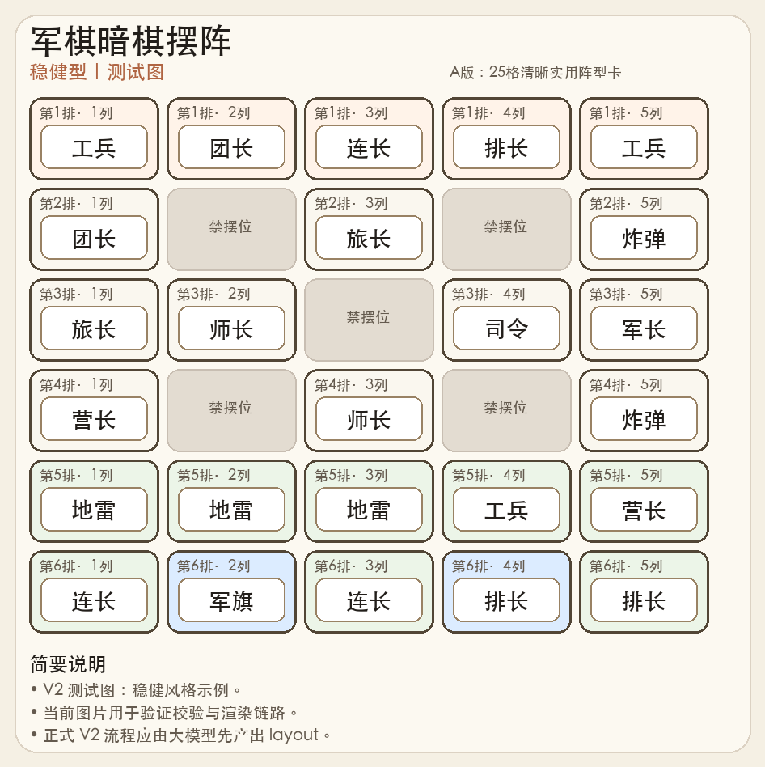
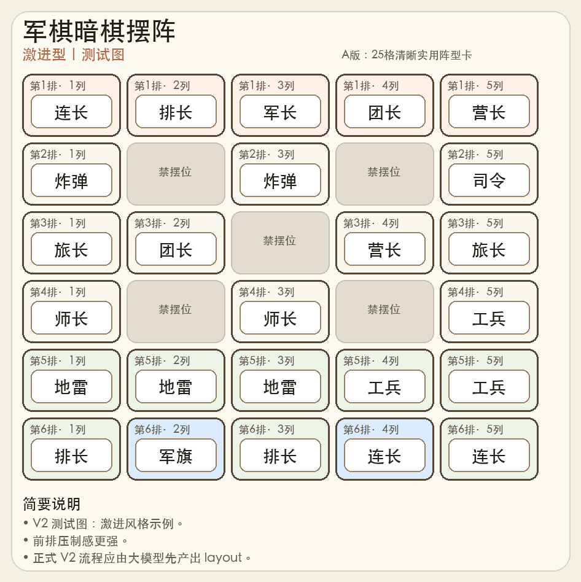
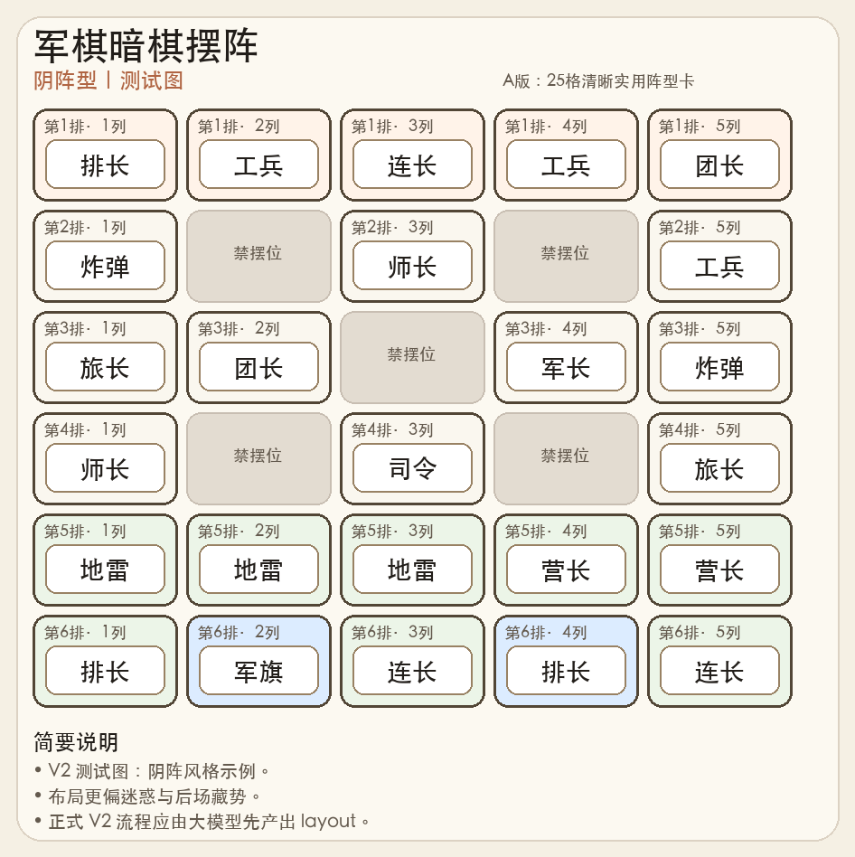
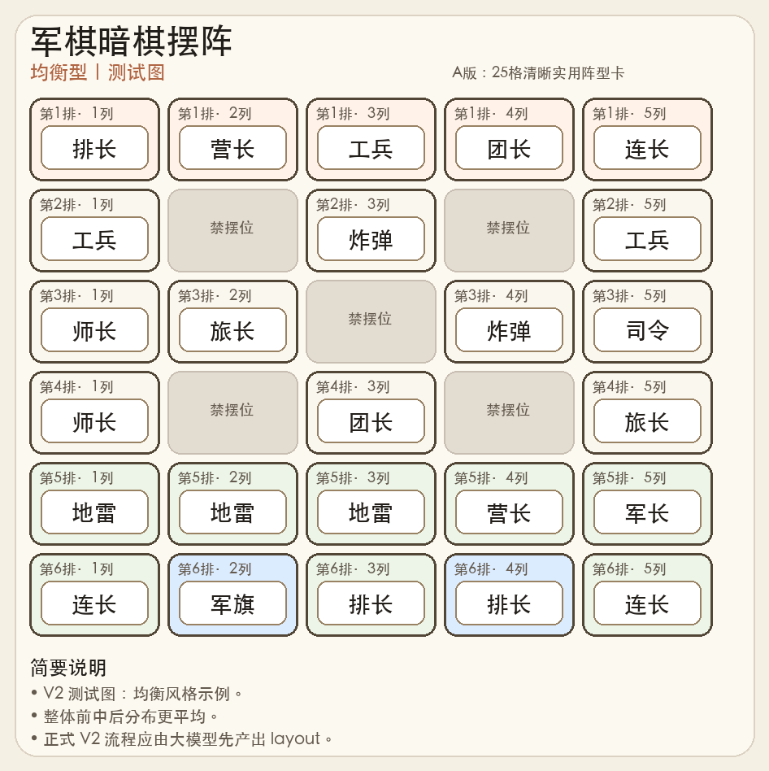

# junqi-dark-layout

一个用于生成中国军棋（双人 25 格暗棋）摆阵、做硬规则校验并渲染成图片卡片的 OpenClaw / Codex AgentSkill。

## 这个仓库里有什么

仓库采用“外层仓库 + 内层 skill 目录”的结构：

```text
.
├── README.md
├── .gitignore
├── junqi-dark-layout/
│   ├── SKILL.md
│   └── scripts/
│       ├── generate_layout.py
│       └── render_layout.py
└── junqi-dark-layout.skill
```

其中：

- `junqi-dark-layout/SKILL.md`：skill 主说明
- `junqi-dark-layout/scripts/generate_layout.py`：旧版 Python 阵型生成器（V2 中不再作为首选主路径）
- `junqi-dark-layout/scripts/validate_layout.py`：对阵型做硬规则校验
- `junqi-dark-layout/scripts/render_layout.py`：把阵型渲染成图片卡片
- `junqi-dark-layout.skill`：已打包好的 skill 文件

## 效果预览

下面是 4 张最新测试阵型卡片效果图：

### 示例一：稳健型



### 示例二：激进型



### 示例三：阴阵型



### 示例四：均衡型



## 功能简介

这个 skill 在 V2 中主要解决三件事：

1. 由**大模型生成**更有策略感的军棋暗棋摆阵
2. 由 **Python 严格校验**阵型是否合法
3. 输出成**清晰、可直接分享**的阵型图片

支持的风格：

- 稳健
- 激进
- 阴阵
- 均衡

支持的侧重：

- 均衡
- 保旗
- 中攻
- 侧攻
- 迷惑

## 规则模型

当前实现基于**双人 25 格标准棋盘**：

- 己方区域为 6 行 × 5 列的 30 个位置
- 其中 5 个固定禁摆位
- 实际可摆放 25 个棋子
- 大本营位于：第 6 排第 2 / 第 4 列

核心合法性约束包括：

- 军旗只能放在大本营
- 地雷只能放在后两排，且不能放进大本营
- 炸弹不能放在第一排
- 大本营中的棋子不可移动

此外还内置了一套默认启发式，例如：

- 重要大子尽量保留行动空间
- 不让前三线全堆小子
- 至少保留一个较活的工兵
- 后两排更多承担护旗、藏雷、迷惑、伏击功能

## 依赖

运行脚本需要：

- Python 3
- Pillow

可用下面方式安装 Pillow：

```bash
pip install pillow
```

## 直接运行示例

### 1）先准备一个阵型 JSON

V2 推荐流程不是直接依赖 Python 生成，而是：

- 先由大模型生成一个 `layout` 数组
- 再交给 Python 校验
- 校验通过后再渲染图片

### 2）校验阵型是否合法

```bash
python3 junqi-dark-layout/scripts/validate_layout.py \
  --layout '["连长","师长","排长","团长","司令","炸弹","禁","工兵","禁","旅长","连长","工兵","禁","军长","营长","师长","禁","炸弹","禁","旅长","地雷","地雷","团长","营长","排长","工兵","军旗","连长","排长","地雷"]'
```

示例输出：

```json
{
  "valid": true,
  "errors": [],
  "checks": {
    "layout_length_ok": true,
    "cell_values_known": true,
    "forbidden_cells_ok": true,
    "valid_cells_filled": true,
    "piece_counts_ok": true,
    "flag_in_hq": true,
    "mines_legal": true,
    "bombs_not_in_front_row": true
  }
}
```

### 3）渲染成图片

```bash
python3 junqi-dark-layout/scripts/render_layout.py \
  --title "军棋暗棋摆阵" \
  --subtitle "稳健型｜均衡" \
  --layout '["连长","师长","排长","团长","司令","炸弹","禁","工兵","禁","旅长","连长","工兵","禁","军长","营长","师长","禁","炸弹","禁","旅长","地雷","地雷","团长","营长","排长","工兵","军旗","连长","排长","地雷"]' \
  --notes '["风格：稳健｜侧重：均衡","适合常规开局","保留基础工兵机动"]' \
  --output ./output/junqi-layout.png
```

## 在 OpenClaw / Codex 中使用

如果你是把它当 AgentSkill 用，核心文件是：

- `junqi-dark-layout/SKILL.md`

通常可按 skill 标准方式打包：

```bash
scripts/package_skill.py junqi-dark-layout
```

如果你的环境里没有这套脚本，也可以直接把 skill 目录单独拿去使用。

## V2 架构说明

当前推荐架构是：

- **大模型**：负责生成具体阵型
- **Python**：负责硬规则校验
- **Python**：负责图片渲染

也就是说，Python 不再是主生成器，而是裁判和出图工具。

## 推荐调用流程

推荐按照下面顺序使用：

1. 由大模型输出一个 30 格 `layout` JSON
2. 使用 `validate_layout.py` 校验
3. 若失败，把 `errors` 回喂给大模型并重试 2~3 次
4. 校验通过后，再用 `render_layout.py` 生成图片

推荐让大模型只输出 JSON，不要夹带大段说明文字。

## 公开仓库前的说明

这个仓库当前主要包含：

- 规则说明
- 本地 Python 脚本
- 打包产物

适合公开展示和分享，但仍建议在改成 public 之前做这些检查：

1. 确认没有提交测试图片、临时输出、日志文件
2. 确认没有提交本地路径、账号信息、访问令牌
3. 确认 `.DS_Store`、`__pycache__/`、临时目录都被 `.gitignore` 忽略
4. 如果不想公开打包产物，可去掉 `junqi-dark-layout.skill`

## License

如果你准备公开发布，建议补一个许可证文件，例如：

- MIT（最宽松，最适合分享）
- Apache-2.0（也很常见）

如果你愿意，我可以下一步直接帮你补一个 `LICENSE`（推荐 MIT）。
